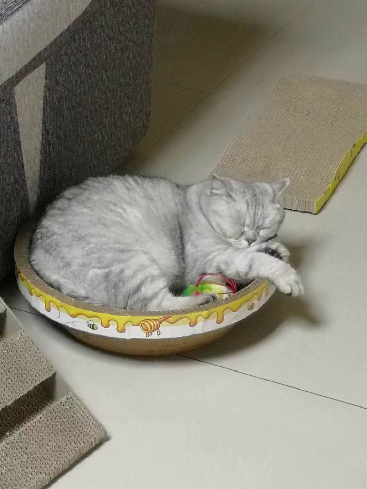

# Who Am I?
> Imagination is the essence of discovery.

I am Yunding Wu, a 4th year undergraduate student at **UC San Diego**, and I major in *Mathematics-Computer Science*.

```
print('Hello World')
```

[Link to my github page](https://github.com/YundingWu)

## Favorite Courses
- MATH 184
- CSE 151B
- CSE 158
- etc.

## Skills I Want to Learn
- [x] Machine Learning
- [ ] Game Development
- [ ] Database

### My Cat


[Another picture of my cat](./cat2.jpg)